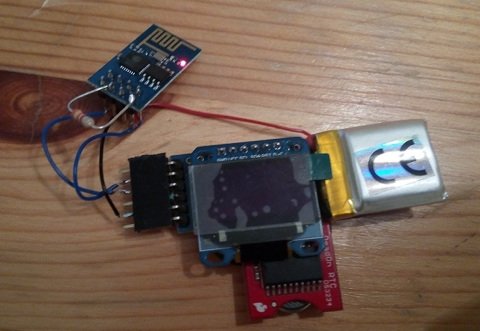

**This project is currently on hold. It seems the current firmware of the ESP8266 modules stuggles with SSIDs listing. It often hangs or returns inconsistent results**

An open WiFi finder based on the ESP8266 WiFi chip. The device scans all available networks and when it finds an open one it attempts to join it and open a connection to a remote server. In this way only truly open (no sign-in page) networks are identified. The SSIDs of the open networks are finally shown on display.

The picture below shows first prototype of the finder:

The Arduino is behind the display. The red PCB on the bottom is a RTC which is not used in this project but was there as this hardware has been recycled from other projects.
